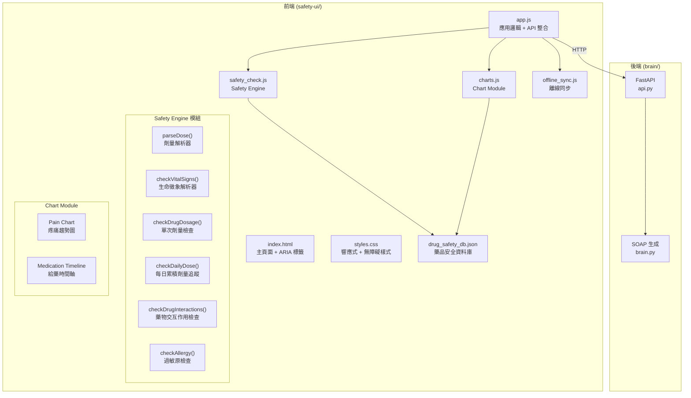
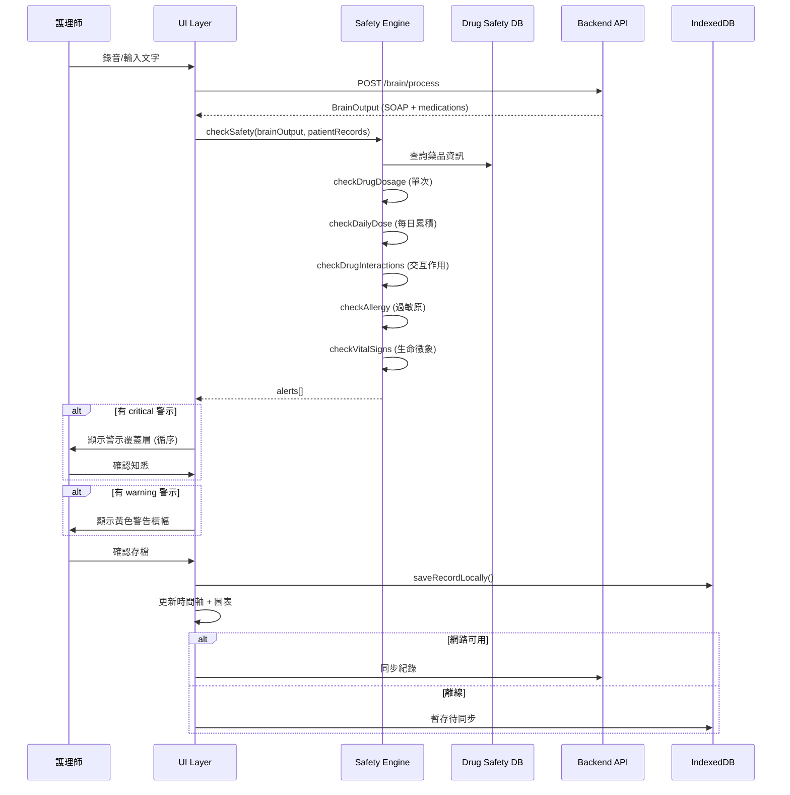

# 設計文件：Safety & UI Layer 增強

## Overview

本設計文件描述 VoiceNursy 安全防呆與前端介面層的增強方案。現有系統為無框架的 vanilla HTML/CSS/JS 前端搭配 Python FastAPI 後端，已具備基礎 SOAP 生成、單次劑量檢查、過敏原比對、生命徵象警戒及疼痛趨勢圖。

本次增強涵蓋三大面向：

1. **安全引擎強化**：每日累積劑量追蹤、藥物交互作用檢查、劑量解析器與生命徵象解析器強化、藥品資料庫擴充至 20+ 種藥品
2. **UI/UX 改善**：給藥時間軸視覺化、危險狀態 UI 回饋（循序警示、警告橫幅）、無障礙設計（ARIA、焦點鎖定、對比度）、響應式設計（平板/手機斷點）、存檔動畫改善
3. **工程基礎設施**：Vitest + fast-check 前端測試框架、後端 API 整合強化（逾時、離線、重試）

設計原則：
- 維持 vanilla JS 架構，不引入前端框架
- 所有安全邏輯保持在前端 `safety_check.js`，確保離線時仍可運作
- 使用 ES Modules 重構以支援 Vitest 測試
- 漸進式增強，不破壞現有功能

## Architecture

### 系統架構圖



### 資料流程



### 模組化策略

現有程式碼使用全域函式與 `<script>` 標籤載入。為支援 Vitest 測試，需將核心邏輯重構為 ES Modules：

| 檔案 | 匯出 | 用途 |
|------|------|------|
| `safety_check.js` | `parseDose`, `checkDrugDosage`, `checkDailyDose`, `checkDrugInteractions`, `checkAllergy`, `checkVitalSigns`, `checkSafety`, `findDrug` | 安全引擎核心（可獨立測試） |
| `charts.js` | `initPainChart`, `updatePainChart`, `initMedicationTimeline`, `updateMedicationTimeline` | 圖表模組 |
| `offline_sync.js` | `initOfflineDB`, `saveRecordLocally`, `getUnsyncedRecords`, `autoSync` | 離線同步 |

每個檔案同時支援 ES Module `export` 與瀏覽器全域存取（透過條件式 export 模式）：

```javascript
// 條件式 export 模式
if (typeof module !== 'undefined' && module.exports) {
  module.exports = { parseDose, checkDrugDosage, ... };
}
```

## Components and Interfaces

### 1. Safety Engine (`safety_check.js`)

#### parseDose(dose, unit) → number | null
增強劑量解析器，支援 mcg/μg 單位：

```javascript
/**
 * 解析劑量文字為毫克數值
 * @param {string|number} dose - 劑量值（如 "500", "1.5"）
 * @param {string} unit - 單位（如 "mg", "g", "mcg", "μg"）
 * @returns {number|null} 毫克數值，無法解析時回傳 null
 */
function parseDose(dose, unit) {
  if (dose == null || dose === '') return null;
  const n = parseFloat(String(dose).replace(/[^\d.]/g, ''));
  if (isNaN(n) || n < 0) return null;
  const u = (unit || '').toLowerCase().trim();
  if (u === 'g') return n * 1000;
  if (u === 'mcg' || u === 'μg') return n / 1000;
  return n; // 預設為 mg
}
```

#### formatDose(mg, targetUnit) → string
新增反向格式化函式，支援 round-trip 驗證：

```javascript
/**
 * 將毫克數值轉回指定單位的字串
 * @param {number} mg - 毫克數值
 * @param {string} targetUnit - 目標單位
 * @returns {string} 格式化後的劑量字串
 */
function formatDose(mg, targetUnit) {
  const u = (targetUnit || 'mg').toLowerCase().trim();
  if (u === 'g') return (mg / 1000).toString();
  if (u === 'mcg' || u === 'μg') return (mg * 1000).toString();
  return mg.toString();
}
```

#### checkDailyDose(medication, patientRecords, drugDB) → alert | null
新增每日累積劑量檢查：

```javascript
/**
 * 檢查某藥品的每日累積劑量
 * @param {Object} medication - 當前藥物 {name, dose, unit}
 * @param {Array} patientRecords - 該病患當日所有已存檔紀錄
 * @param {Object} drugDB - 藥品安全資料庫
 * @returns {Object|null} 警示物件或 null
 */
function checkDailyDose(medication, patientRecords, drugDB) { ... }
```

#### checkDrugInteractions(medications, drugDB) → alert[]
新增藥物交互作用檢查：

```javascript
/**
 * 檢查藥物兩兩組合的交互作用
 * @param {Array} medications - 藥物清單
 * @param {Object} drugDB - 含 interactions 陣列的資料庫
 * @returns {Array} 交互作用警示陣列
 */
function checkDrugInteractions(medications, drugDB) { ... }
```

#### checkVitalSigns(text, vitalSignsDB) → alert[]
強化生命徵象解析器，新增 RR 支援：

```javascript
// 新增 RR 解析
const rr = text.match(/RR\s*(\d+)/i);
if (rr) {
  const val = parseInt(rr[1]);
  if (val > v.respiratory_rate.max || val < v.respiratory_rate.min) {
    alerts.push({ type: 'vital_abnormal', ... });
  }
}
```

### 2. Chart Module (`charts.js`)

#### Medication Timeline

使用 Chart.js scatter chart 實作水平時間軸：

```javascript
/**
 * 初始化給藥時間軸
 * @param {HTMLCanvasElement} canvas - 繪圖目標
 */
function initMedicationTimeline(canvas) { ... }

/**
 * 更新給藥時間軸資料
 * @param {Array} records - 病患給藥紀錄
 * @param {Array} alerts - 當前警示清單
 */
function updateMedicationTimeline(records, alerts) { ... }
```

時間軸節點設計：
- 正常給藥：藍色圓點 (`#2d3a8c`)
- 觸發警示：紅色圓點 (`#c62828`) + ⚠️ 圖示
- Tooltip：藥名、劑量、單位、給藥途徑、時間

### 3. UI Layer (`app.js` + `index.html`)

#### 警示系統增強

```javascript
/**
 * 循序顯示多筆警示
 * @param {Array} alerts - 警示陣列
 */
function showAlerts(alerts) {
  const criticals = alerts.filter(a => a.severity === 'critical');
  const warnings = alerts.filter(a => a.severity === 'warning');
  
  // critical: 循序顯示覆蓋層
  if (criticals.length > 0) {
    showAlertSequence(criticals, 0);
  }
  
  // warning: 顯示黃色橫幅
  if (warnings.length > 0) {
    showWarningBanner(warnings);
  }
}

function showAlertSequence(alerts, index) {
  if (index >= alerts.length) return;
  showAlert(alerts[index]);
  // ackAlert 時呼叫 showAlertSequence(alerts, index + 1)
}
```

#### 焦點鎖定（Focus Trap）

```javascript
/**
 * 在警示覆蓋層內鎖定焦點
 */
function trapFocus(overlayElement) {
  const focusable = overlayElement.querySelectorAll(
    'button, [href], input, select, textarea, [tabindex]:not([tabindex="-1"])'
  );
  const first = focusable[0];
  const last = focusable[focusable.length - 1];
  
  overlayElement.addEventListener('keydown', (e) => {
    if (e.key === 'Tab') {
      if (e.shiftKey && document.activeElement === first) {
        e.preventDefault();
        last.focus();
      } else if (!e.shiftKey && document.activeElement === last) {
        e.preventDefault();
        first.focus();
      }
    }
  });
  first.focus();
}
```

#### API 整合強化

```javascript
/**
 * 帶逾時與重試的 fetch 包裝
 * @param {string} url
 * @param {Object} options - fetch options
 * @param {number} timeout - 逾時毫秒數（預設 10000）
 * @returns {Promise<Response>}
 */
async function fetchWithTimeout(url, options = {}, timeout = 10000) {
  const controller = new AbortController();
  const timer = setTimeout(() => controller.abort(), timeout);
  try {
    const response = await fetch(url, { ...options, signal: controller.signal });
    clearTimeout(timer);
    return response;
  } catch (e) {
    clearTimeout(timer);
    if (e.name === 'AbortError') {
      throw new Error('API 請求逾時，請檢查網路連線');
    }
    throw e;
  }
}
```

### 4. Drug Safety DB (`drug_safety_db.json`)

擴充結構，新增 `interactions` 陣列：

```json
{
  "drugs": [ /* 20+ 藥品 */ ],
  "interactions": [
    {
      "drug1": "Warfarin",
      "drug2": "Aspirin",
      "severity": "critical",
      "description": "增加出血風險，Warfarin 與 Aspirin 併用可能導致嚴重出血"
    }
  ],
  "vital_signs": { /* 含 respiratory_rate */ }
}
```

## Data Models

### 藥品資料模型 (Drug Entry)

```typescript
interface DrugEntry {
  name: string;              // 標準英文藥名
  aliases: string[];         // 別名（含中文）
  max_single_dose_mg: number; // 最大單次劑量 (mg)
  max_daily_dose_mg: number;  // 最大每日劑量 (mg)
  common_dose_mg: number;     // 常用劑量 (mg)
  unit: string;              // 預設單位
  route: string[];           // 給藥途徑
  warning: string;           // 警示語
}
```

### 藥物交互作用模型 (Drug Interaction)

```typescript
interface DrugInteraction {
  drug1: string;       // 藥物 1 名稱
  drug2: string;       // 藥物 2 名稱
  severity: 'critical' | 'warning';
  description: string; // 交互作用描述
}
```

### 警示模型 (Alert)

```typescript
interface Alert {
  type: 'dosage_exceeded' | 'daily_dose_exceeded' | 'daily_dose_approaching'
      | 'drug_interaction' | 'allergy' | 'vital_abnormal';
  severity: 'critical' | 'warning';
  item: string;       // 觸發項目（藥名或生命徵象名稱）
  detected: string;   // 偵測值
  range: string;      // 正常/允許範圍
  message: string;    // 警示訊息
}
```

### 給藥紀錄模型 (Medication Record)

```typescript
interface MedicationRecord {
  patientId: string;
  time: string;           // HH:MM 格式
  date: string;           // YYYY-MM-DD 格式
  medications: MedicationEntity[];
  alerts: Alert[];
  soap: SOAPEntry;
  pain_scale: number | null;
}
```

### 藥品安全資料庫 JSON Schema

```json
{
  "$schema": "http://json-schema.org/draft-07/schema#",
  "type": "object",
  "required": ["drugs", "interactions", "vital_signs"],
  "properties": {
    "drugs": {
      "type": "array",
      "items": {
        "type": "object",
        "required": ["name", "aliases", "max_single_dose_mg", "max_daily_dose_mg", "common_dose_mg", "unit", "route", "warning"],
        "properties": {
          "name": { "type": "string" },
          "aliases": { "type": "array", "items": { "type": "string" } },
          "max_single_dose_mg": { "type": "number", "minimum": 0 },
          "max_daily_dose_mg": { "type": "number", "minimum": 0 },
          "common_dose_mg": { "type": "number", "minimum": 0 },
          "unit": { "type": "string" },
          "route": { "type": "array", "items": { "type": "string" } },
          "warning": { "type": "string" }
        }
      }
    },
    "interactions": {
      "type": "array",
      "items": {
        "type": "object",
        "required": ["drug1", "drug2", "severity", "description"],
        "properties": {
          "drug1": { "type": "string" },
          "drug2": { "type": "string" },
          "severity": { "enum": ["critical", "warning"] },
          "description": { "type": "string" }
        }
      }
    },
    "vital_signs": { "type": "object" }
  }
}
```


## Correctness Properties

*A property is a characteristic or behavior that should hold true across all valid executions of a system — essentially, a formal statement about what the system should do. Properties serve as the bridge between human-readable specifications and machine-verifiable correctness guarantees.*

### Property 1: Dose parser round-trip

*For any* valid dose value (positive number) and any supported unit ("mg", "g", "mcg", "μg"), parsing the dose to milligrams then formatting back to the original unit and re-parsing should produce the same milligram value: `parseDose(formatDose(parseDose(d, u), u), u) === parseDose(d, u)`.

**Validates: Requirements 5.1, 5.2, 5.3, 5.6**

### Property 2: Dose parser rejects invalid input

*For any* input that is null, undefined, empty string, or a string containing no numeric characters, `parseDose` should return `null` without throwing an error.

**Validates: Requirements 5.4**

### Property 3: Dose parser non-negativity invariant

*For any* valid dose string and unit where `parseDose` returns a non-null value, the result should be a non-negative number (≥ 0).

**Validates: Requirements 5.5**

### Property 4: Daily dose sum correctness

*For any* set of patient medication records spanning multiple days and any target drug, `checkDailyDose` should compute the cumulative dose by summing only records matching today's calendar date (00:00–23:59) and the target drug name (including aliases), ignoring records from other dates or other drugs.

**Validates: Requirements 2.1, 2.4**

### Property 5: Daily dose threshold alerts

*For any* drug in the safety database and any cumulative daily dose value: if the cumulative dose exceeds `max_daily_dose_mg`, a "daily_dose_exceeded" alert with severity "critical" should be produced; if the cumulative dose is between 80% and 100% of `max_daily_dose_mg`, a "daily_dose_approaching" alert with severity "warning" should be produced; otherwise no daily dose alert should be produced.

**Validates: Requirements 2.2, 2.3**

### Property 6: Single dose threshold alerts

*For any* drug in the safety database and any dose value exceeding `max_single_dose_mg`, `checkDrugDosage` should produce a "dosage_exceeded" alert with severity "critical". For any dose value at or below `max_single_dose_mg`, no alert should be produced.

**Validates: Requirements 10.3**

### Property 7: Drug interaction detection with alias resolution

*For any* pair of medications from a BrainOutput where a known interaction exists in the safety database (matched by canonical name or any alias), `checkDrugInteractions` should produce a "drug_interaction" alert containing both drug names, the correct severity, and the interaction description. For pairs with no known interaction, no alert should be produced.

**Validates: Requirements 3.2, 3.3, 3.4**

### Property 8: Vital sign extraction completeness

*For any* text string containing valid vital sign patterns (BP systolic/diastolic, HR, SpO2, BT, RR) with varying whitespace, `checkVitalSigns` should extract all present vital signs and produce alerts for those outside the defined normal ranges.

**Validates: Requirements 6.1, 6.2, 6.3, 6.5**

### Property 9: Vital sign parser graceful handling

*For any* arbitrary text string that does not contain recognizable vital sign patterns (no "BP", "HR", "SpO2", "BT", "RR" followed by numbers), `checkVitalSigns` should return an empty array without throwing an error.

**Validates: Requirements 6.4**

### Property 10: Drug safety DB JSON round-trip

*For any* drug entry in the safety database, `JSON.parse(JSON.stringify(entry))` should produce an object deeply equal to the original entry.

**Validates: Requirements 4.4**

### Property 11: Drug safety DB schema completeness

*For any* drug entry in the safety database, the entry should contain all required fields (`name`, `aliases`, `max_single_dose_mg`, `max_daily_dose_mg`, `common_dose_mg`, `unit`, `route`, `warning`) with correct types (string, array, number, number, number, string, array, string).

**Validates: Requirements 4.3**

### Property 12: Timeline node danger flagging

*For any* medication record that has associated alerts, the corresponding timeline node data should be flagged as "danger" (red). For records with no alerts, the node should use the default style.

**Validates: Requirements 1.2**

### Property 13: Timeline tooltip content completeness

*For any* medication entity in a timeline record, the generated tooltip string should contain the drug name, dose, unit, route, and administration time.

**Validates: Requirements 1.3**

### Property 14: Sequential alert display ordering

*For any* list of critical alerts, the alert display system should present them one at a time in the original order — the (i+1)-th alert should only be shown after the user acknowledges the i-th alert.

**Validates: Requirements 7.4**

## Error Handling

### Safety Engine 錯誤處理

| 情境 | 處理方式 |
|------|----------|
| `drug_safety_db.json` 載入失敗 | 記錄錯誤至 console，Safety Engine 回傳空警示陣列，UI 顯示「安全資料庫載入失敗」橫幅 |
| `parseDose` 收到無效輸入 | 回傳 `null`，不拋出錯誤，跳過該藥物的劑量檢查 |
| `checkVitalSigns` 收到無法解析的文字 | 回傳空陣列，不拋出錯誤 |
| 藥品不在資料庫中 | `findDrug` 回傳 `null`，跳過劑量檢查，不產生警示 |
| 病患無過敏紀錄 | `checkAllergy` 回傳 `null`，跳過過敏檢查 |

### API 整合錯誤處理

| 情境 | 處理方式 |
|------|----------|
| HTTP 4xx 錯誤 | 解析 `detail` 欄位，顯示中文錯誤訊息（如「登入失敗：帳號或密碼錯誤」） |
| HTTP 5xx 錯誤 | 顯示「伺服器暫時無法處理，請稍後重試」 |
| 網路中斷 (`fetch` 拋出 `TypeError`) | 自動切換離線模式，更新網路狀態指示器，SOAP 紀錄暫存 IndexedDB |
| API 逾時（> 10 秒） | `AbortController` 中止請求，顯示逾時提示，提供「重試」按鈕 |
| 網路恢復 | 觸發 `autoSync()`，逐筆同步暫存紀錄，完成後顯示「同步完成」通知 |

### 存檔錯誤處理

| 情境 | 處理方式 |
|------|----------|
| 存檔成功 | 播放打勾動畫（2-3 秒），禁用存檔按鈕防止重複提交，動畫結束後清除 SOAP 卡片 |
| 存檔失敗（網路錯誤） | 顯示失敗提示，提供「重試」與「離線暫存」兩個選項 |
| IndexedDB 寫入失敗 | 記錄錯誤至 console，顯示「本地儲存失敗」警告 |

## Testing Strategy

### 測試框架

- **測試執行器**：Vitest（快速、原生 ESM 支援）
- **Property-Based Testing**：fast-check（JavaScript PBT 函式庫）
- **斷言庫**：Vitest 內建（`expect`）

### 專案設定

```
safety-ui/
├── vitest.config.js
├── package.json
├── __tests__/
│   ├── parseDose.test.js          # Property 1, 2, 3
│   ├── dailyDose.test.js          # Property 4, 5
│   ├── drugDosage.test.js         # Property 6
│   ├── drugInteractions.test.js   # Property 7
│   ├── vitalSigns.test.js         # Property 8, 9
│   ├── drugSafetyDB.test.js       # Property 10, 11
│   ├── timeline.test.js           # Property 12, 13
│   └── alertSystem.test.js        # Property 14
```

### 測試分類

#### Property-Based Tests（fast-check，每個至少 100 次迭代）

每個 property test 必須以註解標記對應的設計屬性：

```javascript
// Feature: safety-ui-layer, Property 1: Dose parser round-trip
test.prop('parseDose round-trip', [fc.double({min: 0.001, max: 10000}), fc.constantFrom('mg', 'g', 'mcg', 'μg')], (dose, unit) => {
  const mg = parseDose(dose.toString(), unit);
  if (mg === null) return; // skip invalid
  const formatted = formatDose(mg, unit);
  const reparsed = parseDose(formatted, unit);
  expect(reparsed).toBeCloseTo(mg, 6);
});
```

Property tests 涵蓋：Properties 1–14（如上列）

#### Unit Tests（example-based）

- 時間軸空狀態佔位文字（Req 1.4）
- 時間軸即時更新（Req 1.5）
- 警示覆蓋層顯示/隱藏（Req 7.1, 7.3）
- 警示音效觸發（Req 7.2）
- Warning 橫幅顯示（Req 7.5）
- API 錯誤訊息映射（Req 11.1）
- 逾時處理（Req 11.4）
- 存檔按鈕禁用/啟用（Req 12.2）
- 存檔失敗選項（Req 12.3）
- 存檔後清除 SOAP（Req 12.4）

#### Integration Tests

- ARIA 標籤完整性審計（Req 8.1）
- Tab 順序驗證（Req 8.2）
- 焦點鎖定行為（Req 8.3）
- aria-live 區域更新（Req 8.5）
- 離線/上線模式切換（Req 11.2, 11.3）

#### Smoke Tests

- 藥品資料庫至少 20 種藥品（Req 4.1）
- 至少 5 筆交互作用（Req 4.2）
- Vitest + fast-check 環境可正常執行（Req 10.1）

### 測試執行

```bash
# 執行所有測試
npx vitest run

# 執行特定測試檔
npx vitest run __tests__/parseDose.test.js

# 執行 property tests（verbose 模式）
npx vitest run --reporter=verbose
```
