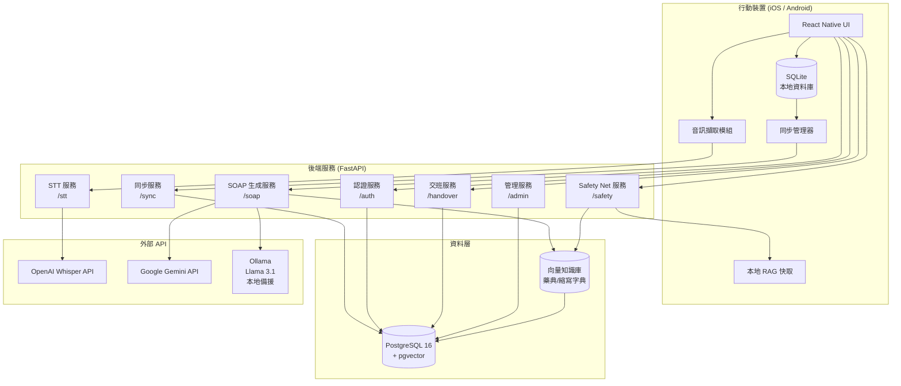
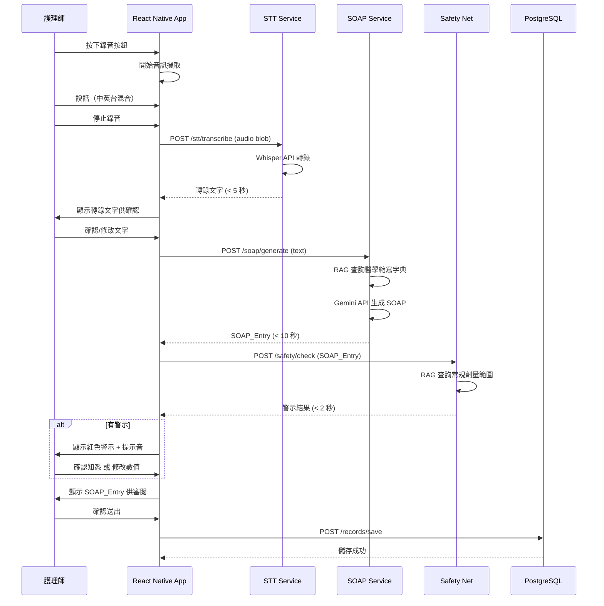
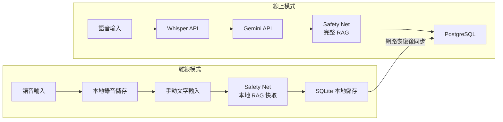
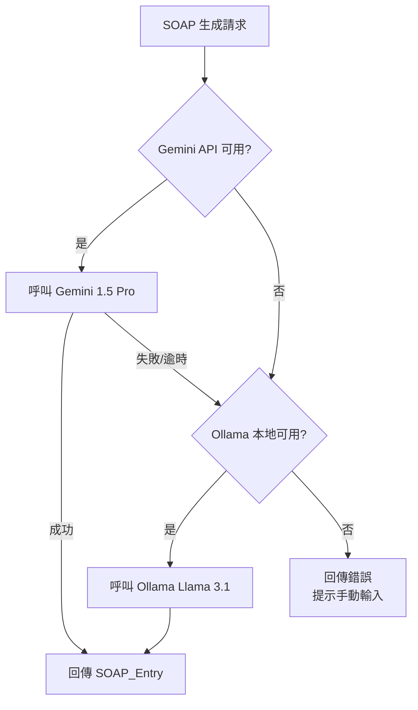

# 技術設計文件：護理聲助手 (VoiceNursy)

## 概覽

VoiceNursy 是一款以行動裝置為主的 AI 輔助護理記錄系統，核心目標是在不改變護理師巡房習慣的前提下，透過語音輸入自動生成符合評鑑標準的 SOAP 病歷，並提供主動防呆用藥警示與視覺化交班儀表板。

### 設計目標

- **低摩擦輸入**：護理師無需學習新操作流程，以自然語音完成病歷記錄
- **高可靠性**：離線模式確保網路不穩定時照護不中斷
- **醫療安全**：Safety_Net 模組在 2 秒內攔截異常數值，防止疲勞給藥錯誤
- **資料一致性**：所有病歷以繁體中文標準格式輸出，符合台灣醫療評鑑規範

### 技術棧摘要

| 層級 | 技術選擇 | 理由 |
|------|---------|------|
| 前端 | React Native (TypeScript) | 單一程式碼庫支援 iOS/Android，生態系成熟 |
| STT | OpenAI Whisper API (large-v3) | 支援中英混合，醫學術語辨識率高 |
| LLM | Google Gemini 1.5 Pro API（主）/ Ollama + Llama 3.1（備） | Gemini 長上下文視窗適合 SOAP 生成；Ollama 作為離線降級方案 |
| RAG | pgvector (PostgreSQL 擴充) | 統一資料庫，避免額外維護獨立向量資料庫 |
| 後端 | Python FastAPI | 非同步高效能，與 LangChain/LlamaIndex 整合良好 |
| 資料庫 | PostgreSQL 16 + pgvector | 關聯式資料 + 向量搜尋一體化 |
| 本地儲存 | SQLite (via expo-sqlite) | React Native 離線模式本地持久化 |

---

## 架構

### 系統架構圖



### 請求流程：語音輸入到 SOAP 儲存



### 離線模式架構



---

## 元件與介面

### 前端元件（React Native）

#### 核心模組

| 元件 | 職責 |
|------|------|
| `AudioRecorder` | 音訊擷取、噪音偵測、錄音時長控制（最長 5 分鐘） |
| `TranscriptEditor` | 顯示 STT 結果、提供逐字修改介面 |
| `SOAPViewer` | 顯示四欄 SOAP 結構、支援欄位編輯、標示「待確認」項目 |
| `AlertOverlay` | 紅色閃爍警示覆蓋層、提示音播放、強制確認互動 |
| `HandoverDashboard` | 病患清單、時間軸、生命徵象折線圖 |
| `OfflineIndicator` | 離線狀態指示器、同步進度顯示 |
| `SyncManager` | 背景同步排程、衝突偵測、重試邏輯 |

#### 狀態管理

採用 **Zustand** 進行全域狀態管理，搭配 **React Query** 處理伺服器狀態快取與同步。

```
AppState
├── auth: { user, token, role }
├── recording: { isRecording, audioBlob, duration }
├── transcript: { text, isConfirmed }
├── soapEntry: { S, O, A, P, pendingItems, status }
├── alerts: Alert[]
├── offline: { isOffline, pendingSync: SyncQueue[] }
└── patients: Patient[]
```

### 後端 API 端點（FastAPI）

#### 認證服務 `/auth`

| 方法 | 路徑 | 說明 |
|------|------|------|
| POST | `/auth/login` | 員工編號 + 密碼登入，回傳 JWT |
| POST | `/auth/logout` | 登出，撤銷 token |
| POST | `/auth/refresh` | 刷新 JWT |
| GET | `/auth/me` | 取得當前使用者資訊 |

#### STT 服務 `/stt`

| 方法 | 路徑 | 說明 |
|------|------|------|
| POST | `/stt/transcribe` | 接收音訊檔案，回傳轉錄文字 |

**請求格式：**
```json
{
  "audio": "<base64 encoded audio>",
  "format": "m4a | wav | webm",
  "hint": "medical"
}
```

**回應格式：**
```json
{
  "transcript": "病人主訴胸悶，BP 140/90，給予 Aspirin 100mg",
  "confidence": 0.92,
  "duration_ms": 3200,
  "language_detected": "zh-TW+en"
}
```

#### SOAP 生成服務 `/soap`

| 方法 | 路徑 | 說明 |
|------|------|------|
| POST | `/soap/generate` | 輸入轉錄文字，回傳 SOAP_Entry |
| PUT | `/soap/entries/{id}` | 更新 SOAP_Entry |
| POST | `/soap/entries/{id}/confirm` | 確認並儲存 SOAP_Entry |

#### Safety Net 服務 `/safety`

| 方法 | 路徑 | 說明 |
|------|------|------|
| POST | `/safety/check` | 分析 SOAP_Entry，回傳警示清單 |
| POST | `/safety/acknowledge` | 記錄護理師對警示的處置選擇 |

#### 交班服務 `/handover`

| 方法 | 路徑 | 說明 |
|------|------|------|
| GET | `/handover/dashboard` | 取得當前班次儀表板資料 |
| GET | `/handover/patients/{id}/timeline` | 取得病患時間軸 |
| GET | `/handover/patients/{id}/vitals` | 取得生命徵象趨勢資料 |
| POST | `/handover/export/pdf` | 匯出交班摘要 PDF |

#### 同步服務 `/sync`

| 方法 | 路徑 | 說明 |
|------|------|------|
| POST | `/sync/push` | 上傳離線期間產生的資料 |
| GET | `/sync/pull` | 拉取最新資料 |
| POST | `/sync/resolve` | 提交衝突解決結果 |

#### 管理服務 `/admin`

| 方法 | 路徑 | 說明 |
|------|------|------|
| GET/POST | `/admin/users` | 管理護理師帳號 |
| PUT/DELETE | `/admin/users/{id}` | 修改/停用帳號 |
| POST | `/admin/rag/update` | 更新藥典向量資料庫 |
| GET | `/admin/stats` | 取得系統使用統計 |

### RAG 引擎介面

RAG_Engine 封裝為 FastAPI 內部服務，透過 LangChain 與 pgvector 整合：

```python
class RAGEngine:
    def query_medical_abbreviation(self, term: str) -> AbbreviationResult
    def query_drug_dosage(self, drug_name: str, route: str) -> DosageRange
    def query_vital_range(self, vital_sign: str, patient_context: dict) -> VitalRange
    def check_drug_interaction(self, drugs: list[str]) -> list[InteractionWarning]
    def update_knowledge_base(self, documents: list[Document]) -> UpdateResult
```

---

## 資料模型

### PostgreSQL 資料表

#### `users` — 使用者帳號

```sql
CREATE TABLE users (
    id          UUID PRIMARY KEY DEFAULT gen_random_uuid(),
    employee_id VARCHAR(20) UNIQUE NOT NULL,
    name        VARCHAR(100) NOT NULL,
    role        VARCHAR(20) NOT NULL CHECK (role IN ('nurse', 'head_nurse', 'admin')),
    department  VARCHAR(100),
    is_active   BOOLEAN DEFAULT TRUE,
    failed_login_attempts INT DEFAULT 0,
    locked_until TIMESTAMPTZ,
    created_at  TIMESTAMPTZ DEFAULT NOW(),
    updated_at  TIMESTAMPTZ DEFAULT NOW()
);
```

#### `patients` — 病患基本資料

```sql
CREATE TABLE patients (
    id          UUID PRIMARY KEY DEFAULT gen_random_uuid(),
    mrn         VARCHAR(20) UNIQUE NOT NULL,  -- 病歷號
    name        VARCHAR(100) NOT NULL,
    ward        VARCHAR(50),
    bed_number  VARCHAR(10),
    attending_nurse_id UUID REFERENCES users(id),
    is_active   BOOLEAN DEFAULT TRUE,
    created_at  TIMESTAMPTZ DEFAULT NOW()
);
```

#### `soap_entries` — SOAP 病歷條目

```sql
CREATE TABLE soap_entries (
    id              UUID PRIMARY KEY DEFAULT gen_random_uuid(),
    patient_id      UUID NOT NULL REFERENCES patients(id),
    nurse_id        UUID NOT NULL REFERENCES users(id),
    shift           VARCHAR(20) NOT NULL CHECK (shift IN ('day', 'evening', 'night')),
    subjective      TEXT,
    objective       TEXT,
    assessment      TEXT,
    plan            TEXT,
    pending_items   JSONB DEFAULT '[]',  -- 待確認項目
    raw_transcript  TEXT,               -- 原始轉錄文字
    status          VARCHAR(20) DEFAULT 'draft' CHECK (status IN ('draft', 'confirmed', 'synced')),
    local_id        VARCHAR(50),        -- 離線模式本地 ID
    created_at      TIMESTAMPTZ DEFAULT NOW(),
    confirmed_at    TIMESTAMPTZ,
    synced_at       TIMESTAMPTZ
);

CREATE INDEX idx_soap_entries_patient_shift ON soap_entries(patient_id, shift, created_at);
```

#### `alerts` — 警示記錄

```sql
CREATE TABLE alerts (
    id              UUID PRIMARY KEY DEFAULT gen_random_uuid(),
    soap_entry_id   UUID NOT NULL REFERENCES soap_entries(id),
    nurse_id        UUID NOT NULL REFERENCES users(id),
    alert_type      VARCHAR(50) NOT NULL,  -- 'dosage_exceeded', 'vital_abnormal', 'drug_interaction'
    item_name       VARCHAR(200) NOT NULL,
    detected_value  VARCHAR(100),
    normal_range    VARCHAR(100),
    severity        VARCHAR(20) CHECK (severity IN ('warning', 'critical')),
    action_taken    VARCHAR(50) CHECK (action_taken IN ('acknowledged', 'modified', NULL)),
    triggered_at    TIMESTAMPTZ DEFAULT NOW(),
    resolved_at     TIMESTAMPTZ
);
```

#### `rag_documents` — RAG 知識庫（pgvector）

```sql
CREATE EXTENSION IF NOT EXISTS vector;

CREATE TABLE rag_documents (
    id          UUID PRIMARY KEY DEFAULT gen_random_uuid(),
    doc_type    VARCHAR(50) NOT NULL,  -- 'drug', 'abbreviation', 'vital_range'
    title       VARCHAR(500) NOT NULL,
    content     TEXT NOT NULL,
    metadata    JSONB DEFAULT '{}',
    embedding   vector(1536),          -- OpenAI text-embedding-3-small 維度
    updated_by  UUID REFERENCES users(id),
    updated_at  TIMESTAMPTZ DEFAULT NOW()
);

CREATE INDEX idx_rag_embedding ON rag_documents USING ivfflat (embedding vector_cosine_ops)
    WITH (lists = 100);
```

#### `audit_logs` — 稽核日誌

```sql
CREATE TABLE audit_logs (
    id          UUID PRIMARY KEY DEFAULT gen_random_uuid(),
    user_id     UUID REFERENCES users(id),
    action      VARCHAR(100) NOT NULL,
    resource    VARCHAR(100),
    resource_id UUID,
    details     JSONB DEFAULT '{}',
    ip_address  INET,
    created_at  TIMESTAMPTZ DEFAULT NOW()
);
```

### SQLite 本地資料模型（離線模式）

```typescript
// 本地 SOAP 草稿（離線時使用）
interface LocalSOAPDraft {
  localId: string;          // UUID，離線生成
  patientMrn: string;
  audioPath: string;        // 本地音訊檔案路徑
  transcript?: string;
  soapContent?: {
    S?: string; O?: string; A?: string; P?: string;
  };
  status: 'pending_sync' | 'synced' | 'conflict';
  createdAt: string;        // ISO 8601
}

// 本地 RAG 快取（Safety Net 離線使用）
interface LocalRAGCache {
  docType: 'drug' | 'vital_range';
  key: string;              // 藥物名稱或生命徵象類型
  normalRange: { min: number; max: number; unit: string };
  cachedAt: string;
  expiresAt: string;        // 快取有效期（預設 24 小時）
}
```

---

## 正確性屬性

*屬性（Property）是指在系統所有有效執行情境下都應成立的特性或行為——本質上是對系統應做什麼的形式化陳述。屬性作為人類可讀規格與機器可驗證正確性保證之間的橋樑。*

### 屬性 1：STT 轉錄結果包含醫學縮寫

*對於任意* 包含常見醫學縮寫（BP、HR、SpO2、PRN、QD、BID）的語音輸入，STT_Engine 的轉錄結果應保留這些縮寫的原始英文格式，不得將其翻譯或轉換為中文。

**驗證需求：2.3**

---

### 屬性 2：SOAP 分類覆蓋所有轉錄內容

*對於任意* 非空的轉錄文字，SOAP_Generator 生成的 SOAP_Entry 中，四個欄位（S、O、A、P）的文字內容加上「待確認」標記項目，應涵蓋轉錄文字中所有的臨床資訊，不得遺漏。

**驗證需求：3.1、3.5**

---

### 屬性 3：Safety Net 警示觸發的完整性

*對於任意* 包含數值或劑量資訊的 SOAP_Entry，若 RAG_Engine 中存在對應的常規範圍資料，且偵測值超出該範圍，則 Safety_Net 必定觸發警示；若 RAG_Engine 中不存在對應資料，則必定顯示「無法驗證」提示。Safety_Net 不得在上述兩種情況下靜默略過。

**驗證需求：4.1、4.6**

---

### 屬性 4：警示確認後方可儲存

*對於任意* 觸發了 Alert 的 SOAP_Entry，在護理師明確選擇「確認知悉並繼續」或「修改數值」之前，系統不得將該 SOAP_Entry 儲存至資料庫。

**驗證需求：4.4**

---

### 屬性 5：離線資料同步完整性

*對於任意* 在離線模式下產生並儲存至本地 SQLite 的 SOAP_Entry，當網路恢復後執行同步，若無衝突，該 SOAP_Entry 應完整出現在後端 PostgreSQL 資料庫中，且所有欄位值與本地版本一致。

**驗證需求：6.4**

---

### 屬性 6：SOAP 輸出語言一致性

*對於任意* 語言（中文、英文、台語）的語音輸入，SOAP_Generator 生成的 SOAP_Entry 主體文字應為繁體中文，且國際通用醫學縮寫（如 BP、HR、SpO2）應以英文原文保留。

**驗證需求：7.1、7.2**

---

### 屬性 7：帳號鎖定後無法登入

*對於任意* 已被鎖定（locked_until > 現在時間）的帳號，無論輸入何種密碼，系統均應拒絕登入並回傳鎖定狀態，直到鎖定時間到期。

**驗證需求：1.2**

---

### 屬性 8：有關聯病歷的帳號無法刪除

*對於任意* 仍有關聯 Patient_Record 的 Nurse 帳號，Admin 執行刪除操作時，系統應拒絕並回傳錯誤訊息，帳號與病歷均應保持不變。

**驗證需求：8.5**

---

## 錯誤處理

### 錯誤分類與處理策略

| 錯誤類型 | 觸發情境 | 處理策略 | 使用者回饋 |
|---------|---------|---------|-----------|
| STT 逾時 | Whisper API > 5 秒未回應 | 重試 1 次，失敗後回傳錯誤 | 「語音辨識逾時，請重試」 |
| 音訊品質不足 | 噪音 > 70 dB 或信噪比過低 | 保留原始錄音，提示重錄 | 「語音品質不佳，請重新錄製」 |
| LLM API 失敗 | Gemini API 不可用 | 自動切換至 Ollama 備援 | 無感知切換（後台日誌記錄） |
| RAG 查詢失敗 | pgvector 查詢逾時 | 回傳「無法驗證」警示 | 「無法驗證，請人工確認」（黃色） |
| 網路中斷 | 連線中斷 > 3 秒 | 切換離線模式 | 離線模式指示器 |
| 同步衝突 | 離線資料與後端版本不一致 | 保留兩份版本 | 通知護理師進行人工確認 |
| 認證失敗 | 密碼錯誤 5 次 | 鎖定帳號 15 分鐘 | 「帳號已鎖定，請 15 分鐘後再試」 |
| 身份驗證服務離線 | Auth 服務不可用 | 顯示錯誤，不允許登入 | 「系統暫時無法連線，請聯繫管理員」 |
| 刪除有關聯帳號 | Admin 刪除有病歷的帳號 | 拒絕操作 | 「該帳號仍有關聯病歷，請先轉移紀錄」 |

### API 錯誤回應格式

所有 FastAPI 端點統一使用以下錯誤格式：

```json
{
  "error": {
    "code": "STT_TIMEOUT",
    "message": "語音辨識逾時，請重試",
    "details": {},
    "timestamp": "2024-01-15T10:30:00Z"
  }
}
```

### LLM 備援切換邏輯



---

## 測試策略

### 雙軌測試方法

本系統採用**單元測試**與**屬性測試**並行的雙軌策略：

- **單元測試**：驗證具體範例、邊界條件與錯誤情境
- **屬性測試**：驗證跨所有輸入的通用屬性（使用 [Hypothesis](https://hypothesis.readthedocs.io/) 函式庫）

### 屬性測試配置

- 使用 Python **Hypothesis** 函式庫進行屬性測試
- 每個屬性測試最少執行 **100 次迭代**
- 每個測試以標籤標注對應的設計屬性：
  - 格式：`# Feature: voice-nursy, Property {N}: {property_text}`

### 各模組測試重點

#### STT 服務測試
- **屬性測試（屬性 1）**：生成包含各種醫學縮寫的音訊輸入，驗證縮寫保留
- **單元測試**：正常轉錄、噪音過高、逾時、5 分鐘長音訊

#### SOAP 生成服務測試
- **屬性測試（屬性 2）**：生成隨機臨床描述文字，驗證 SOAP 分類覆蓋完整性
- **屬性測試（屬性 6）**：生成多語言輸入，驗證輸出語言一致性
- **單元測試**：標準 SOAP 生成、無法分類項目標記、LLM 備援切換

#### Safety Net 服務測試
- **屬性測試（屬性 3）**：生成隨機數值/劑量的 SOAP_Entry，驗證警示觸發完整性
- **屬性測試（屬性 4）**：驗證有警示的 SOAP_Entry 在確認前無法儲存
- **單元測試**：各類警示類型（劑量超標、生命徵象異常、藥物交互作用）

#### 認證服務測試
- **屬性測試（屬性 7）**：生成隨機密碼，驗證鎖定帳號的拒絕行為
- **單元測試**：正常登入、密碼錯誤計數、自動登出、角色權限

#### 同步服務測試
- **屬性測試（屬性 5）**：生成隨機離線 SOAP_Entry，驗證同步後資料完整性
- **單元測試**：衝突偵測、衝突保留兩份版本、同步通知

#### 管理服務測試
- **屬性測試（屬性 8）**：生成有/無關聯病歷的帳號，驗證刪除保護
- **單元測試**：帳號 CRUD、藥典更新、統計報表

### 整合測試

- 端對端語音輸入 → SOAP 儲存流程（使用測試音訊檔案）
- 離線模式切換與同步流程
- 交班儀表板資料載入效能（< 5 秒）
- PDF 匯出功能

### 效能測試基準

| 操作 | 目標時間 | 測試方法 |
|------|---------|---------|
| STT 轉錄 | < 5 秒 | 使用 30 秒測試音訊 |
| SOAP 生成 | < 10 秒 | 使用標準臨床描述文字 |
| Safety Net 檢查 | < 2 秒 | 使用包含多種數值的 SOAP_Entry |
| 交班儀表板載入 | < 5 秒 | 模擬 20 位病患資料 |
| 離線同步 | < 60 秒 | 模擬 10 筆離線 SOAP_Entry |
