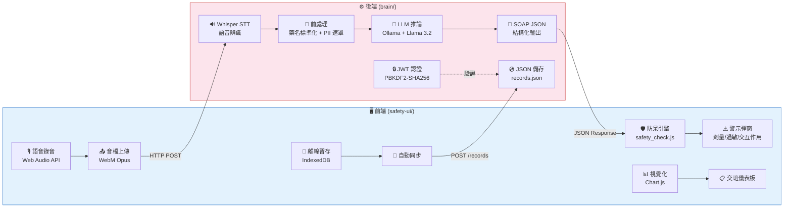

<p align="center">
  
</p>

<h1 align="center">🏥 VoiceNursy 護理聲助手</h1>

<p align="center">
  <strong>語音驅動的智慧護理紀錄系統 — 隱形的 AI 護理長</strong>
</p>

<p align="center">
  
  
  
  
  
  
</p>

---

## 📌 專案簡介

> **一句話描述：** 護理師在床邊口述，系統自動辨識語音、生成 SOAP 病歷、攔截異常劑量，全程本地運行，資料不出院。

### 🎯 解決的問題

台灣護理師每天花費 **2-3 小時** 手寫或打字輸入護理紀錄，佔據了大量本應用於照護病患的時間。VoiceNursy 讓護理師只需 **在床邊口述觀察內容**，系統就能：

1. 🎙️ 自動辨識語音（支援中英台混合口述）
2. 🧠 AI 生成結構化 SOAP 護理紀錄
3. 🛡️ 即時攔截劑量異常、過敏藥物、危險交互作用
4. 📊 自動產出視覺化交班報告

**從口述到歸檔，只需 30 秒。**

---

## ✨ 核心功能列表

| 功能 | 說明 |
|------|------|
| 🎙️ **語音輸入** | Web Audio API 瀏覽器即時錄音，WebM Opus 編碼，支援暫停/繼續 |
| 🔊 **語音辨識** | OpenAI Whisper 本地 CPU 推論，醫療術語 Prompt 優化（50+ 關鍵詞注入） |
| 🧹 **文字前處理** | 藥名標準化（30+ 映射）、醫學縮寫統一（18 種）、PII 個資遮罩 |
| 🧠 **SOAP 生成** | Ollama + Llama 3.2:3b 本地推論，Gemini 2.0 Flash / GPT-4o 備援 |
| 🛡️ **藥物安全防呆** | 35 種藥物資料庫、25 組交互作用、單次/每日劑量檢查、過敏原交叉比對 |
| 📊 **生命徵象監測** | BP / HR / SpO2 / BT / RR 五項警戒值，支援中英文格式輸入 |
| 👥 **共享護理紀錄** | 跨護理師、跨班別、跨裝置共享，所有紀錄即時同步 |
| 📋 **交班儀表板** | 統計摘要（病患數/警示數/紀錄數）、疼痛趨勢圖、給藥時間軸、列印功能 |
| 🔒 **安全認證** | JWT Token + PBKDF2-SHA256 600,000 次迭代 + 登入速率限制（5 次/15 分鐘） |
| 📱 **離線支援** | IndexedDB 本地暫存，網路恢復自動同步，斷網照用 |
| ✏️ **紀錄編輯** | 存檔後可修改 SOAP 內容（僅限允許欄位） |
| 🔍 **病患搜尋** | 支援姓名、床號、診斷關鍵字即時搜尋 |
| ⏸️ **錄音暫停/繼續** | MediaRecorder pause/resume API，護理師可中途暫停再繼續 |
| 📝 **操作紀錄** | Audit Log 完整記錄所有操作，供安全稽核 |
| 🖨️ **列印交班報告** | 一鍵列印交班摘要，方便紙本備份 |

---

## 🏗️ 系統架構圖



### 三層架構

```
┌─────────────────────────────────────────────────────────────┐
│                    🎙️ 語音輸入層                             │
│  Web Audio API → WebM Opus → Whisper STT → 文字前處理       │
│  (瀏覽器錄音)    (音檔編碼)   (本地辨識)    (藥名+縮寫標準化) │
├─────────────────────────────────────────────────────────────┤
│                    🧠 AI 處理層                              │
│  PII 遮罩 → Prompt Engineering → Ollama LLM → SOAP JSON    │
│  (個資保護)  (角色扮演+規則約束)  (本地推論)    (結構化輸出)   │
├─────────────────────────────────────────────────────────────┤
│                    🛡️ 安全防呆層                             │
│  劑量閾值比對 → 過敏原交叉檢查 → 藥物交互作用 → 生命徵象警戒  │
│  (35種藥物)    (NSAIDs/Penicillin) (25組配對)   (5項指標)    │
└─────────────────────────────────────────────────────────────┘
```

---

## 🔧 技術棧

| 類別 | 技術 | 說明 |
|------|------|------|
| **後端框架** | Python 3.12+ / FastAPI | 非同步高效能 API 伺服器 |
| **資料驗證** | Pydantic v2 | 自動型別檢查、範圍限制、API 文件生成 |
| **認證** | python-jose (JWT) | HS256 簽章，8 小時有效期 |
| **密碼雜湊** | hashlib PBKDF2-SHA256 | 600,000 次迭代（OWASP 2024 建議值） |
| **前端** | HTML5 / CSS3 / Vanilla JS | 零框架依賴，任何瀏覽器直接開啟 |
| **LLM 推論** | Ollama + Llama 3.2:3b | 本地運行，不需 GPU，不需網路 |
| **LLM 備援** | Gemini 2.0 Flash / GPT-4o | Ollama 失敗時自動切換雲端備援 |
| **語音辨識** | OpenAI Whisper (base) | 本地 CPU 推論，醫療術語 Prompt 優化 |
| **圖表** | Chart.js 4.x | 疼痛趨勢折線圖、給藥時間軸散佈圖 |
| **離線儲存** | IndexedDB | 斷網暫存，網路恢復自動同步 |
| **後端測試** | pytest + hypothesis | 屬性測試（Property-Based Testing） |
| **前端測試** | vitest + fast-check | 屬性測試（Property-Based Testing） |
| **資料儲存** | JSON 檔案 | patients.json / records.json / users.json |

---

## 🚀 快速開始

### 📋 前置需求

| 軟體 | 版本 | 用途 |
|------|------|------|
| [Python](https://www.python.org/downloads/) | 3.12+ | 後端 API 伺服器 |
| [Node.js](https://nodejs.org/) | 18+ | 前端測試工具（vitest） |
| [Ollama](https://ollama.com) | 最新版 | 本地 LLM 推論引擎 |
| [ffmpeg](https://ffmpeg.org/) | 最新版 | 音檔格式轉換（WebM → WAV） |

### 步驟 1️⃣：安裝 Ollama 並下載模型

```bash
# 到 https://ollama.com 下載並安裝 Ollama
# 安裝完成後，開啟終端機，下載 Llama 3.2 模型：

ollama pull llama3.2:3b

# 確認模型已下載：
ollama list
# 應該會看到 llama3.2:3b
```

### 步驟 2️⃣：安裝後端依賴

```bash
cd brain
pip install -r requirements.txt
```

> 💡 **提示：** 建議使用虛擬環境 `python -m venv .venv` 後再安裝

### 步驟 3️⃣：設定環境變數

```bash
cd brain
cp .env.example .env
```

編輯 `brain/.env`，設定 JWT 密鑰（**必填**）：

```bash
# 產生隨機密鑰：
python -c "import secrets; print(secrets.token_hex(32))"

# 將產生的密鑰貼到 .env 的 JWT_SECRET_KEY 欄位
```

`.env` 檔案內容範例：

```env
LLM_PROVIDER=ollama
OLLAMA_MODEL=llama3.2:3b
OLLAMA_BASE_URL=http://localhost:11434
WHISPER_MODEL_SIZE=base
JWT_SECRET_KEY=你的隨機密鑰貼在這裡

# 備援用（選填，不填也能正常運作）
GEMINI_API_KEY=your_gemini_api_key_here
OPENAI_API_KEY=your_openai_api_key_here

# CORS 允許的來源
CORS_ORIGINS=http://localhost:3000,http://localhost:8080,http://127.0.0.1:3000
```

### 步驟 4️⃣：啟動後端（終端機 1）

```bash
cd brain
python -m uvicorn api:app --reload --port 8001
```

> 看到 `Uvicorn running on http://0.0.0.0:8001` 就表示啟動成功 ✅

### 步驟 5️⃣：啟動前端（終端機 2）

```bash
cd safety-ui
python -m http.server 3000
```

### 步驟 6️⃣：開啟瀏覽器

```
http://localhost:3000
```

🎉 **完成！** 現在可以註冊帳號、新增病患、開始錄音了。

---

## 📖 使用流程

```
1. 註冊/登入
   ↓
2. 新增病患（姓名、床號、年齡、診斷、過敏藥物）
   ↓
3. 選擇病患 → 點擊 🎙️ 錄音 → 口述護理觀察
   ↓
4. 系統自動辨識語音 → 生成 SOAP 護理紀錄
   ↓
5. 🛡️ 安全防呆自動檢查
   • 劑量超標 → 紅色全螢幕警示 + 提示音
   • 過敏藥物 → 禁止使用警告
   • 藥物交互作用 → 危險併用提醒
   • 生命徵象異常 → 警戒值提示
   ↓
6. 確認存檔 → 紀錄自動共享給所有護理師
   ↓
7. 交班時 → 切換到交班儀表板查看摘要
```

### 🖥️ 畫面說明

| 畫面 | 功能 |
|------|------|
| **巡房模式** | 病患列表、語音錄音、SOAP 卡片、疼痛趨勢圖、給藥時間軸 |
| **交班儀表板** | 統計摘要、所有病患紀錄總覽、列印交班報告 |
| **技術架構** | 系統架構圖、各層技術細節、與 ChatGPT 的差異比較 |

---

## 📡 API 文件

後端啟動後，可在 `http://localhost:8001/docs` 查看完整 Swagger API 文件。

### 認證 API

| 方法 | 端點 | 說明 | 認證 |
|------|------|------|------|
| `POST` | `/auth/register` | 護理師註冊 | ❌ |
| `POST` | `/auth/login` | 護理師登入（回傳 JWT） | ❌ |

### 病患管理 API

| 方法 | 端點 | 說明 | 認證 |
|------|------|------|------|
| `GET` | `/patients` | 取得所有病患列表 | ❌ |
| `POST` | `/patients` | 新增病患 | ❌ |
| `DELETE` | `/patients/{id}` | 刪除病患 | ❌ |

### 語音辨識 & SOAP 生成 API

| 方法 | 端點 | 說明 | 認證 |
|------|------|------|------|
| `POST` | `/stt/transcribe` | 上傳音檔 → 語音辨識 | ❌ |
| `POST` | `/brain/process` | 文字 → SOAP 生成 | ❌ |
| `POST` | `/pipeline/full` | 一站式：音檔 → STT → SOAP | ❌ |

### 護理紀錄 API（需 JWT 認證）

| 方法 | 端點 | 說明 | 認證 |
|------|------|------|------|
| `POST` | `/records` | 儲存 SOAP 紀錄 | ✅ JWT |
| `GET` | `/records/patient/{id}` | 查詢病患的所有紀錄 | ✅ JWT |
| `GET` | `/records` | 查詢所有紀錄（支援日期篩選+分頁） | ✅ JWT |
| `PUT` | `/records/{id}` | 編輯紀錄 | ✅ JWT |

### 系統 API

| 方法 | 端點 | 說明 | 認證 |
|------|------|------|------|
| `GET` | `/health` | 健康檢查 | ❌ |

---

## 🔒 安全措施

| 措施 | 實作方式 |
|------|----------|
| **密碼儲存** | PBKDF2-SHA256，600,000 次迭代（OWASP 2024 建議值） |
| **JWT 認證** | HS256 簽章，8 小時有效期，密鑰從環境變數讀取 |
| **登入速率限制** | 每個帳號 5 次失敗 / 15 分鐘，超過回傳 HTTP 429 |
| **CORS 限制** | 允許來源從環境變數 `CORS_ORIGINS` 讀取 |
| **PII 個資遮罩** | 自動偵測並遮罩身分證字號、電話、Email、姓名 |
| **環境變數** | 所有密鑰存放在 `.env`，已加入 `.gitignore` |
| **全程本地運行** | STT 和 LLM 都在本機執行，病歷資料不出院，符合醫療個資法 |
| **輸入驗證** | Pydantic Schema 強制型別檢查，防止注入攻擊 |
| **稽核日誌** | 所有登入/註冊事件記錄到 `auth_log.json` |

---

## 🧪 測試

本專案採用 **屬性測試（Property-Based Testing）** 方法論，確保系統在各種隨機輸入下都能正確運作。

### 後端測試（pytest + hypothesis）

```bash
cd brain
python -m pytest test_records.py -v
```

| 測試類別 | 測試數 | 說明 |
|----------|--------|------|
| 往返一致性 | 100+ | 儲存後查詢，所有欄位完全一致 |
| 時間排序 | 100+ | 多護理師紀錄按時間降序排列 |
| 日期篩選 | 100+ | 篩選結果只包含指定日期 |
| 不存在病患 | 100+ | 無效 ID 正確拋出錯誤 |
| 邊界案例 | 4 | 自動建檔、空紀錄、ID 格式、重複偵測 |

### 前端測試（vitest + fast-check）

```bash
cd safety-ui
npx vitest run
```

| 測試類別 | 測試數 | 說明 |
|----------|--------|------|
| 劑量解析 | 31 | parseDose 各種格式（mg/g/mcg/負數/空值） |
| 藥物交互作用 | 13 | 25 組交互作用配對正確偵測 |
| 每日劑量累積 | 4 | 跨紀錄累積劑量計算 |
| 藥物資料庫 | 8 | 35 種藥物資料完整性 |
| 紀錄管理 | 17 | 時間軸渲染、紀錄格式 |
| 生命徵象 | 8 | BP/HR/SpO2/BT/RR 異常偵測 |
| 警示系統 | 3 | 嚴重度分級、佇列機制 |
| 其他 | 9 | 設定檢查、整合測試 |

### ✅ 測試結果

```
後端：9 tests passed ✅
前端：93 tests passed ✅
總計：102 tests ALL PASSED ✅
```

---

## 📁 專案結構

```
VoiceNursy/
├── 📄 README.md                    # 本文件
├── 📄 .gitignore                   # Git 忽略規則
│
├── 🧠 brain/                       # 後端 API（FastAPI）
│   ├── api.py                      #   API 路由定義（所有端點）
│   ├── auth.py                     #   認證系統（JWT + PBKDF2）
│   ├── brain.py                    #   SOAP 生成主邏輯
│   ├── llm_client.py               #   LLM 客戶端（Ollama/Gemini/OpenAI）
│   ├── prompts.py                  #   SOAP 分類 Prompt 模板
│   ├── schemas.py                  #   Pydantic 資料模型定義
│   ├── stt_service.py              #   Whisper 語音辨識服務
│   ├── correction_dict.py          #   醫療術語校正字典（30+ 藥名映射）
│   ├── pii_redactor.py             #   PII 個資遮罩（身分證/電話/Email）
│   ├── patients.py                 #   病患 CRUD 管理
│   ├── records.py                  #   護理紀錄管理（儲存/查詢/編輯）
│   ├── drug_safety_db.json         #   藥物安全資料庫（35 種藥物）
│   ├── requirements.txt            #   Python 依賴套件
│   ├── .env.example                #   環境變數範本
│   ├── test_records.py             #   後端屬性測試（pytest + hypothesis）
│   └── test_brain.py               #   SOAP 生成快速測試
│
├── 🖥️ safety-ui/                   # 前端介面（Vanilla JS）
│   ├── index.html                  #   主頁面（登入/巡房/交班/技術架構）
│   ├── app.js                      #   應用主邏輯（認證/病患/錄音/SOAP）
│   ├── safety_check.js             #   防呆引擎（劑量/過敏/交互作用/生命徵象）
│   ├── charts.js                   #   疼痛趨勢圖 + 給藥時間軸（Chart.js）
│   ├── offline_sync.js             #   IndexedDB 離線同步機制
│   ├── styles.css                  #   樣式表
│   ├── drug_safety_db.json         #   藥物安全資料庫（與後端同步）
│   ├── logo.png                    #   Logo 圖片
│   ├── package.json                #   Node.js 依賴（vitest + fast-check）
│   ├── vitest.config.js            #   Vitest 測試設定
│   └── __tests__/                  #   前端測試（13 個測試檔案）
│       ├── parseDose.test.js       #     劑量解析測試
│       ├── parseDose.pbt.test.js   #     劑量解析屬性測試
│       ├── drugDosage.pbt.test.js  #     藥物劑量屬性測試
│       ├── drugInteractions.test.js#     藥物交互作用測試
│       ├── drugInteractions.pbt.test.js  # 交互作用屬性測試
│       ├── dailyDose.test.js       #     每日劑量累積測試
│       ├── drugSafetyDB.test.js    #     藥物資料庫完整性測試
│       ├── vitalSigns.test.js      #     生命徵象異常測試
│       ├── alertSystem.pbt.test.js #     警示系統屬性測試
│       ├── records.test.js         #     紀錄管理測試
│       ├── records.pbt.test.js     #     紀錄管理屬性測試
│       ├── timeline.pbt.test.js    #     時間軸屬性測試
│       └── setup.test.js           #     設定檢查測試
│
├── 🎤 input/                       # 獨立語音處理模組
│   ├── pipeline.py                 #   完整流程：錄音→降噪→修剪→STT→清理
│   ├── recorder.py                 #   錄音模組（sounddevice）
│   ├── denoiser.py                 #   環境噪音過濾
│   ├── audio_trim.py               #   頭尾靜音修剪
│   ├── stt.py                      #   STT（Faster-Whisper + VAD 分段）
│   ├── text_cleaner.py             #   文字清理
│   ├── vad.py                      #   語音活動偵測
│   ├── send_to_brain.py            #   傳送到 Brain Layer
│   └── requirements.txt            #   Python 依賴套件
│
└── 📚 docs/                        # 比賽文件
    ├── 初賽書面審查.md
    └── 決賽展演腳本.md
```

---

## ⚡ 與直接使用 ChatGPT 的差異

| 比較項目 | ❌ 直接用 ChatGPT | ✅ VoiceNursy |
|----------|-------------------|---------------|
| **隱私安全** | 病歷資料上傳雲端，違反醫療個資法 | 全程本地運行，資料不出院 |
| **語音辨識** | 無法辨識台語和醫療口語 | Whisper + 醫療術語 Prompt 優化 |
| **劑量防呆** | 沒有劑量檢查機制 | 35 種藥物即時劑量閾值比對，2 秒內攔截 |
| **過敏檢查** | 沒有過敏原交叉檢查 | Penicillin / NSAIDs 交叉過敏自動偵測 |
| **藥物交互作用** | 需要手動詢問 | 25 組危險配對自動兩兩比對 |
| **輸出格式** | 每次格式不同，需要手動整理 | Pydantic Schema 強制 JSON 結構，格式穩定 |
| **離線使用** | 需要網路，醫院 WiFi 不穩就掛 | IndexedDB 離線暫存，斷網照用 |
| **多人協作** | 無法跨護理師共享紀錄 | JWT 認證 + 共享紀錄，跨班別即時同步 |
| **交班報告** | 需要手動彙整 | 自動統計摘要 + 疼痛趨勢圖 + 一鍵列印 |
| **生命徵象** | 需要手動判斷異常 | 5 項指標自動警戒值比對 |
| **費用** | ChatGPT Plus 每月 $20 USD | 完全免費，本地運行 |

---

## 🔮 未來展望

| 方向 | 說明 |
|------|------|
| 🏥 **HIS/EHR 整合** | 支援 HL7 FHIR 標準，與醫院資訊系統對接 |
| 📱 **行動裝置 App** | PWA 或原生 App，護理師可用手機/平板操作 |
| 🗣️ **語音指令操作** | 「幫我查王大明的紀錄」「切換到交班模式」 |
| 📈 **預測性分析** | 根據歷史紀錄預測病患風險（跌倒、壓瘡、感染） |
| 🌐 **多語言支援** | 支援英文、日文等多國語言護理紀錄 |
| 🤖 **智慧提醒** | 自動提醒翻身時間、給藥時間、傷口換藥 |
| 📊 **進階報表** | 科別統計、品質指標、護理時數分析 |

---

## 👥 團隊資訊

<!-- 請在此填入團隊成員資訊 -->

| 角色 | 姓名 | 負責項目 |
|------|------|----------|
| 👨‍💻 開發者 | （請填入） | （請填入） |
| 👩‍💻 開發者 | （請填入） | （請填入） |
| 🎨 設計師 | （請填入） | （請填入） |
| 📋 指導老師 | （請填入） | （請填入） |

---

## 📄 授權

本專案採用 MIT License 授權。

---

<p align="center">
  <strong>🏥 VoiceNursy — 讓護理師回歸照護，讓 AI 處理文書</strong>
</p>
